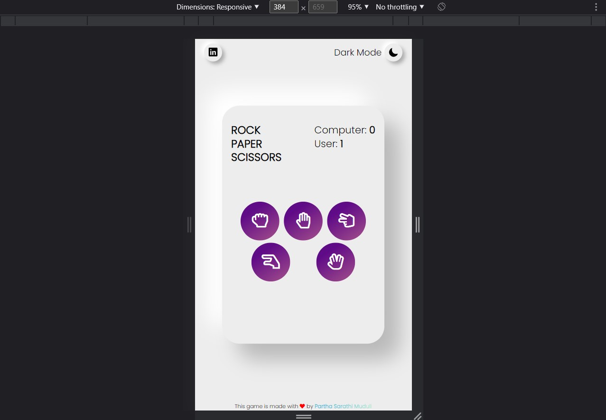

# Rock-Paper-Scissors-Lizard-Spock 
A simple rock-paper-scissor-lizard-spock game with a modern neuromorphism UI.

<b><a href="https://rpsls-bypartha.netlify.app/">Click here</a></b> to view this page

## Contributors
- [Partha Sarathi Muduli](https://github.com/partha7978/text-utils)

## Screenshots

## Functionalities
- Select your choice and play against computer
- Change theme according to your preference
- LocalStorage feature for storing your score

## Tech Stack Used

- [x] HTML
- [x] CSS
- [x] JavaScript
- [x] Font Awesome
- [x] Ionion
- [x] Animate.css

## Contributing
Contributions are welcome. Please open an issue or a pull request on [GitHub](https://github.com/partha7978/Rock-Paper-Scissors-Lizard-Spock)

Copyright (c) 2022 <a href="https://parthasarathimuduli.netlify.app/" target="_self">Partha Sarathi Muduli</a>
